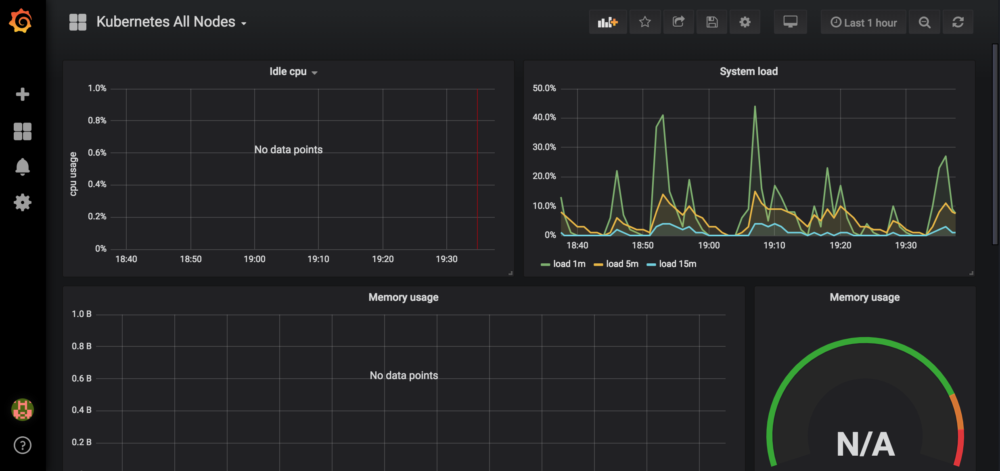
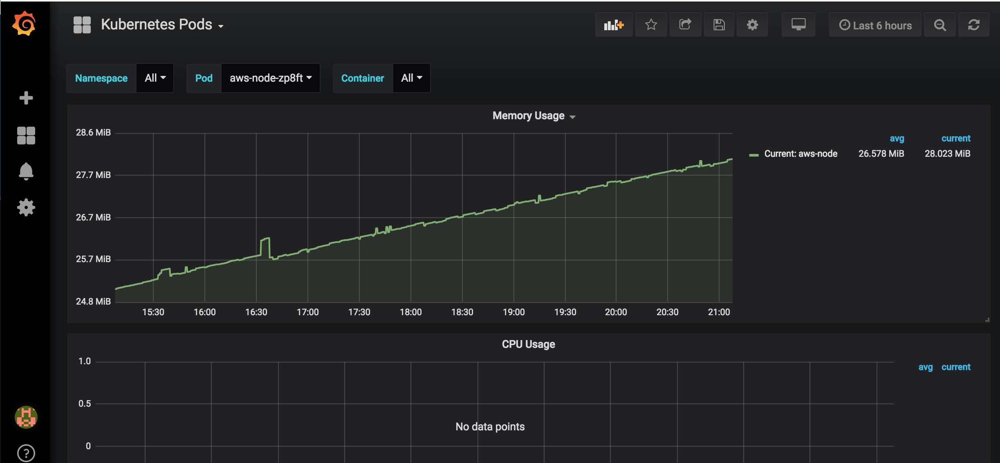

# Introduction

_Prometheus_ is an open source systems monitoring and alerting toolkit that has been adopted by a larger number of companies and organizations. Prometheus is now part of the _Cloud Native Computing Foundation (CNCF)_. It comprises of a Prometheus Server that scrapes and stores time series data and an alertmanager to handle alerts.

# Architecture


_Prometheus_ scrapes metrics from instrumented jobs and stores all scraped samples locally and runs rules over this data or generate alerts. _Grafana_ can be used to visualize the collected data.

# Prometheus Installation

We shall be installing Prometheus and Grafana tools on AWS EKS cluster and we assume that the AWS EKS cluster has already been provisioned. Prometheus and Grafana tools can easily be installed using _helm_

```
helm ls
```
## Configure Storage Class

In order to install Prometheus and Grafana, we can use gp2 EBS volumes for local storage. However for Production deployments it is highly recommended to use io1 EBS volumes for higher performance.

```
kubectl create -f prometheus-storageclass.yaml
```
## Download Prometheus

```
curl -o prometheus-values.yaml https://raw.githubusercontent.com/helm/charts/master/stable/prometheus/values.yaml
```
<ul>
<li>Modify the downloaded file to uncomment the <em>storageClass</em> and set it to <em>"prometheus"</em> at line # 164 and 664</li>
<li>By default Prometheus server is exposed as ClusterIP, hence in order to access the Web UI we need to expose Prometheus server as a NodePort. Search for type: ClusterIP and add nodePort: 30900 and change the type to NodePort as indicated below.</li>

```
    externalIPs: []

    loadBalancerIP: ""
    loadBalancerSourceRanges: []
    servicePort: 80
    nodePort: 30900
    type: NodePort
```
</ul>

## Deploy Prometheus

```
helm install -f prometheus-values.yaml stable/prometheus --name prometheus --namespace prometheus
```

## Check the Prometheus deployment

```
kubectl get all -n prometheus
```
It shall render an output like this:
```
NAME                                                 READY     STATUS    RESTARTS   AGE
pod/prometheus-alertmanager-77cfdf85db-s9p48         2/2       Running   0          1m
pod/prometheus-kube-state-metrics-74d5c694c7-vqtjd   1/1       Running   0          1m
pod/prometheus-node-exporter-6dhpw                   1/1       Running   0          1m
pod/prometheus-node-exporter-nrfkn                   1/1       Running   0          1m
pod/prometheus-node-exporter-rtrm8                   1/1       Running   0          1m
pod/prometheus-pushgateway-d5fdc4f5b-dbmrg           1/1       Running   0          1m
pod/prometheus-server-6d665b876-dsmh9                2/2       Running   0          1m

NAME                                    TYPE        CLUSTER-IP       EXTERNAL-IP   PORT(S)    AGE
service/prometheus-alertmanager         ClusterIP   10.100.89.154    <none>        80/TCP     1m
service/prometheus-kube-state-metrics   ClusterIP   None             <none>        80/TCP     1m
service/prometheus-node-exporter        ClusterIP   None             <none>        9100/TCP   1m
service/prometheus-pushgateway          ClusterIP   10.100.136.143   <none>        9091/TCP   1m
service/prometheus-server               NodePort    10.100.151.245   <none>        80/30900   1m

NAME                                      DESIRED   CURRENT   READY     UP-TO-DATE   AVAILABLE   NODE SELECTOR   AGE
daemonset.apps/prometheus-node-exporter   3         3         3         3            3           <none>          1m

NAME                                            DESIRED   CURRENT   UP-TO-DATE   AVAILABLE   AGE
deployment.apps/prometheus-alertmanager         1         1         1            1           1m
deployment.apps/prometheus-kube-state-metrics   1         1         1            1           1m
deployment.apps/prometheus-pushgateway          1         1         1            1           1m
deployment.apps/prometheus-server               1         1         1            1           1m

NAME                                                       DESIRED   CURRENT   READY     AGE
replicaset.apps/prometheus-alertmanager-77cfdf85db         1         1         1         1m
replicaset.apps/prometheus-kube-state-metrics-74d5c694c7   1         1         1         1m
replicaset.apps/prometheus-pushgateway-d5fdc4f5b           1         1         1         1m
replicaset.apps/prometheus-server-6d665b876                1         1         1         1m
```
## Access the Prometheus server

The Prometheus server can now be accessed at one of the nod eIP addresses at port 30900.

# Grafana Installation

## Download Prometheus

Run the following:

```
curl -o grafana-values.yaml https://raw.githubusercontent.com/helm/charts/master/stable/grafana/values.yaml
```
Edit the _grafana-values.yaml_ file by replacing _storageClass_ with _"prometheus"_, _enabled_ with true and _adminPassword_ with your password _"password"_

```
persistence:
  enabled: true
  storageClassName: "prometheus"
  # accessModes:
  #   - ReadWriteOnce
  # size: 10Gi
  # annotations: {}
  # subPath: ""
  # existingClaim:

adminUser: admin
adminPassword: password
```

Uncomment the datasources section inside the _grafana-values.yaml_ file and set the url attribute to point to the url of the Prometheus server

```
datasources:
 datasources.yaml:
   apiVersion: 1
   datasources:
   - name: Prometheus
     type: prometheus
     url: http://prometheus-server.prometheus.svc.cluster.local
     access: proxy
     isDefault: true
```

Change the grafana service type to LoadBalancer so that its is accessible using a AWS ELB Service url, all of these changes have been made to the file.

```
service:
  type: LoadBalancer
  port: 80
  annotations: {}
  labels: {}
```

## Deploy Grafana

```
helm install -f grafana-values.yaml stable/grafana --name grafana --namespace grafana
```

```
kubectl get all -n grafana
```

Retrieve the ELB url by running the following:
```
export ELB=$(kubectl get svc -n grafana grafana -o jsonpath='{.status.loadBalancer.ingress[0].hostname}')

echo "http://$ELB"
```

# Create Dashboards

Using the ELB url, login to the Grafana dashboard. Since we configured the _datasources_ section above, you will notice that _Install Grafana_ & _create your first data source_ are already completed. Click _+_ button on the left panel and select import, enter 3131 dashboard id under Grafana.com Dashboard and click _Load_. Leave the defaults, select _Prometheus_ as the endpoint under prometheus data sources drop down, click _Import_. This will sow monitoring dashboard for all the cluster nodes.




In order to monitor the EKS Kubernetes cluster pods, create a dashboard and enter 3146 for dashboard id.


